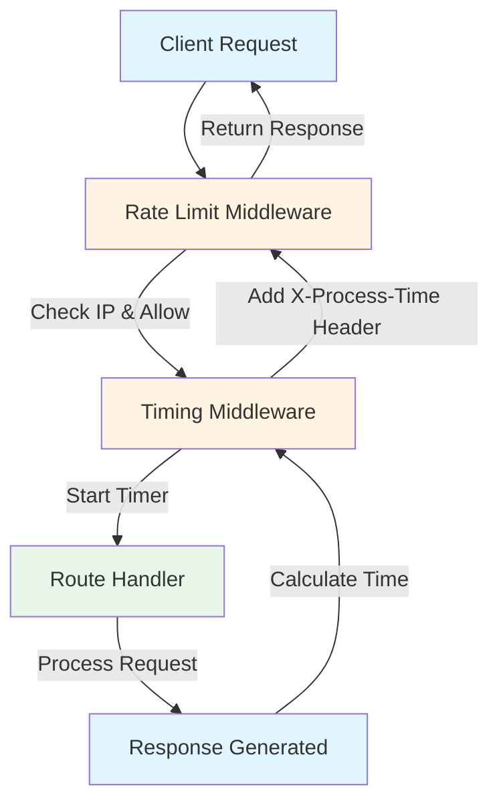
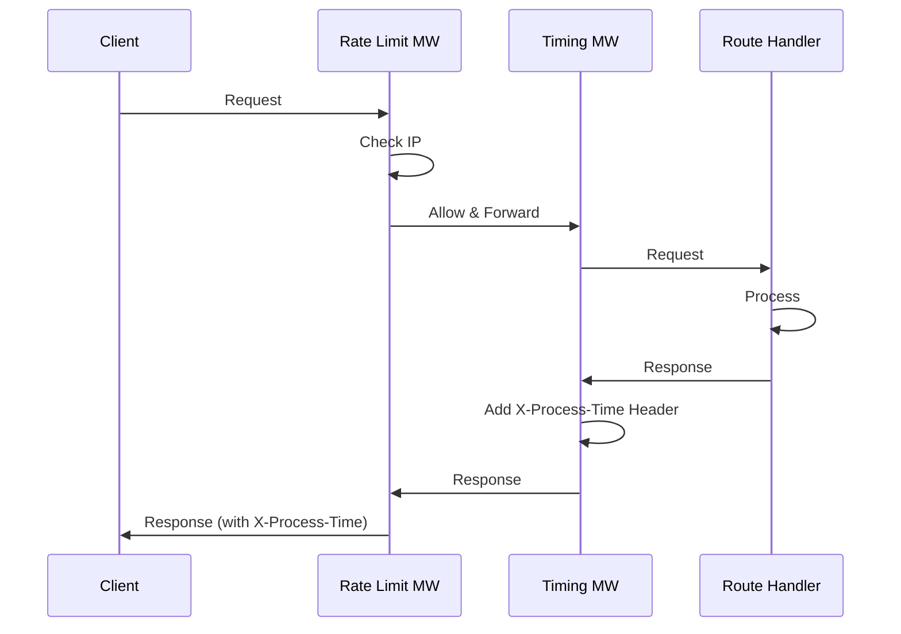
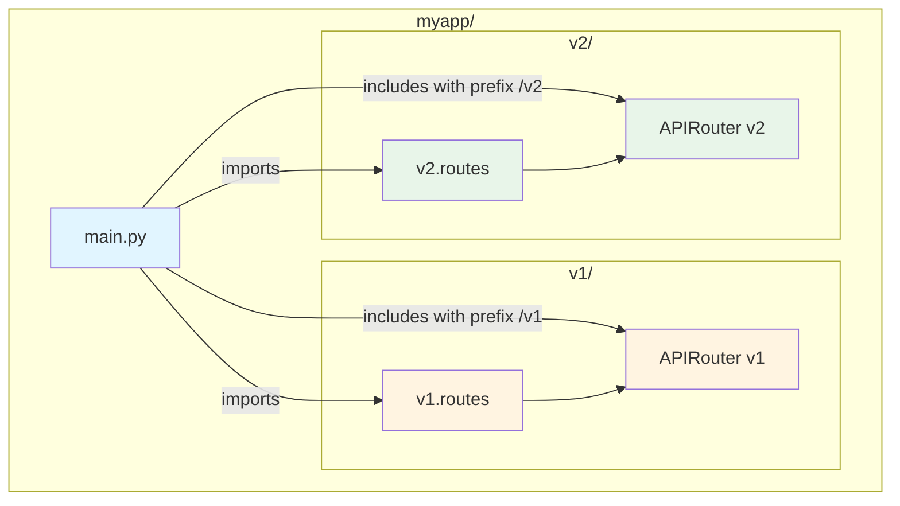
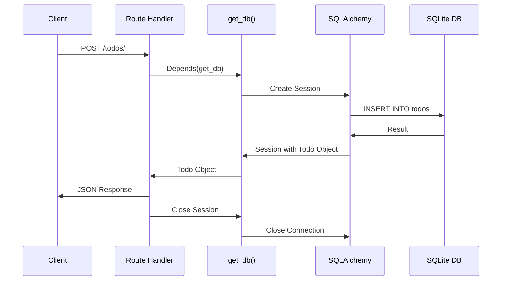
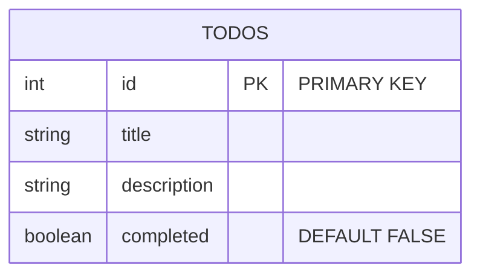
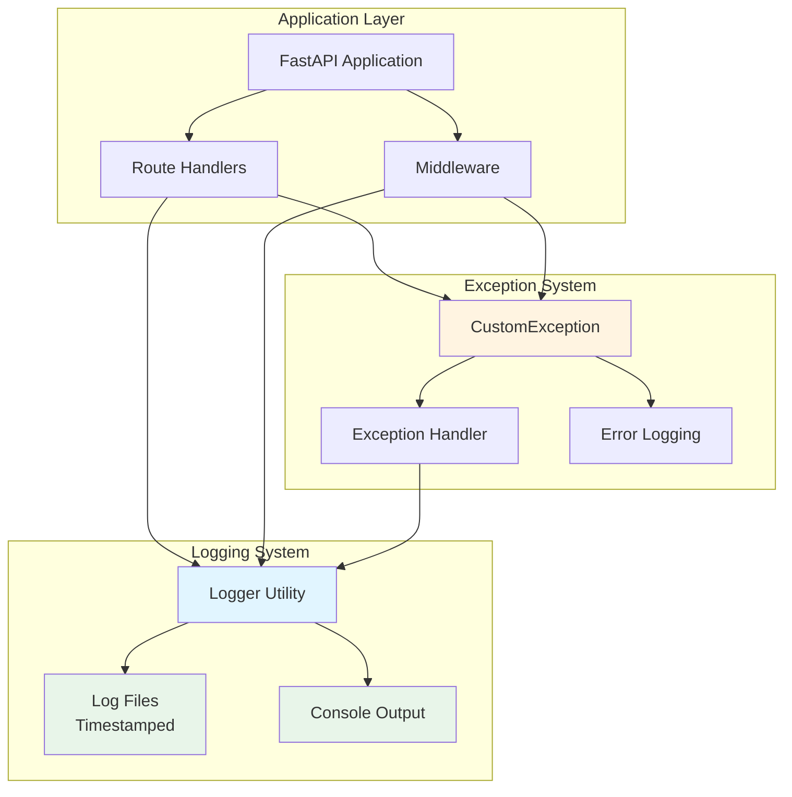

```mermaid
graph TB
    subgraph "Main App (myapp/main.py)"
        Main[FastAPI App]
        Main --> V1Router[Includes v1 router<br/>prefix: /v1]
        Main --> V2Router[Includes v2 router<br/>prefix: /v2]
    end
    
    subgraph "v1/routes.py"
        V1Router --> V1Endpoint[GET /items/&#123;item_id&#125;<br/>Legacy format]
    end
    
    subgraph "v2/routes.py"
        V2Router --> V2Endpoint[GET /items/&#123;item_id&#125;<br/>Enhanced format]
    end
    
    Client[Client Request] --> Main
    
    style Main fill:#e1f5ff
    style V1Router fill:#fff4e1
    style V2Router fill:#e8f5e9
    style V1Endpoint fill:#fff4e1
    style V2Endpoint fill:#e8f5e9
```

```mermaid
graph TB
    subgraph "FastAPI Routes"
        Routes[Route Handlers]
        Routes -->|Depends| DI[Dependency Injection<br/>get_db&#40;&#41;]
        Routes -->|Uses| Pydantic[Pydantic Schemas<br/>Validation]
    end
    
    subgraph "SQLAlchemy ORM"
        DI --> Session[Session Management<br/>database.py]
        Session --> Model[Todo Model<br/>models.py]
        Session --> Query[Query Builder]
    end
    
    subgraph "SQLite Database"
        Query --> DB[(test.db<br/>Persistent Storage)]
    end
    
    subgraph "Background Tasks"
        Routes --> BG[Async Processing<br/>After Response]
    end
    
    style Routes fill:#e1f5ff
    style DI fill:#fff4e1
    style Pydantic fill:#fff4e1
    style Session fill:#e8f5e9
    style Model fill:#e8f5e9
    style Query fill:#e8f5e9
    style DB fill:#f3e5f5
    style BG fill:#ffe0b2
```

# Building Advanced FastAPI Applications: A Comprehensive Guide to Middleware, Versioning, and Database Integration

## Introduction

FastAPI has rapidly become one of the most popular Python web frameworks for building modern APIs. Its combination of high performance, automatic API documentation, and type safety makes it an excellent choice for production applications. In this comprehensive guide, we'll explore three critical advanced concepts: **Middleware**, **API Versioning**, and **Database Integration with Dependency Injection**.

This article provides a complete walkthrough of three independent lab projects, each demonstrating essential FastAPI patterns. By the end, you'll understand how to implement cross-cutting concerns, manage API evolution, and build data-driven applications with proper architectural patterns.

---

## Table of Contents

1. [Project Overview](#project-overview)
2. [Lab 1: Middleware - Timing and Rate Limiting](#lab-1-middleware-timing-and-rate-limiting)
3. [Lab 2: API Versioning](#lab-2-api-versioning)
4. [Lab 3: Database Integration with Dependency Injection](#lab-3-database-integration-with-dependency-injection)
5. [Logging and Exception Handling](#logging-and-exception-handling)
6. [Deployment Strategies](#deployment-strategies)
7. [Comprehensive Testing Guide](#comprehensive-testing-guide)
8. [Best Practices and Patterns](#best-practices-and-patterns)
9. [Conclusion](#conclusion)

---

## Project Overview

Our FastAPI Advanced Lab consists of three independent mini-projects:

1. **Middleware Lab**: Demonstrates timing middleware and IP-based rate limiting
2. **Versioning Lab**: Shows how to structure APIs with multiple versions (v1, v2)
3. **Database Lab**: Integrates SQLAlchemy ORM with dependency injection and background tasks

Each lab is self-contained with its own dependencies, making it easy to understand concepts in isolation before combining them in larger applications.

### Project Structure

```
fastapi-advanced-lab/
├── middleware-lab/
│   ├── main.py
│   ├── utils/
│   │   ├── __init__.py
│   │   ├── logger.py
│   │   └── exception.py
│   ├── logs/              # Generated at runtime
│   ├── requirements.txt
│   ├── Dockerfile
│   └── docker-compose.yml
├── versioning-lab/
│   ├── myapp/
│   │   ├── main.py
│   │   ├── v1/routes.py
│   │   └── v2/routes.py
│   ├── utils/
│   │   ├── __init__.py
│   │   ├── logger.py
│   │   └── exception.py
│   ├── logs/              # Generated at runtime
│   ├── requirements.txt
│   ├── Dockerfile
│   └── docker-compose.yml
└── database-lab/
    ├── main.py
    ├── database.py
    ├── models.py
    ├── schemas.py
    ├── utils/
    │   ├── __init__.py
    │   ├── logger.py
    │   └── exception.py
    ├── data/              # Database storage
    ├── logs/              # Generated at runtime
    ├── requirements.txt
    ├── Dockerfile
    └── docker-compose.yml
```

---

## Lab 1: Middleware - Timing and Rate Limiting

### Theoretical Foundation

**Middleware** in FastAPI allows you to execute code before and after request processing. It's the perfect place to implement cross-cutting concerns that apply to all or most routes, such as:

- Authentication and authorization
- Logging and monitoring
- Rate limiting
- Request/response transformation
- Error handling

FastAPI middleware follows the ASGI (Asynchronous Server Gateway Interface) standard, which means middleware functions receive a `Request` object and a `call_next` function that represents the next middleware or route handler in the chain.

### Architecture Overview



### Code Explanation

Let's examine the middleware implementation:

```python
from fastapi import FastAPI, Request
from fastapi.responses import JSONResponse
import time

app = FastAPI(title="Middleware Lab - Rate Limit & Timing")

# Rate limiting configuration
requests = {}          # Stores timestamps per client IP
RATE_LIMIT = 5         # Max 5 requests
RATE_TIME = 10         # Within 10 seconds
```

**Key Concepts:**

1. **In-Memory Storage**: We use a dictionary to track requests per IP. In production, you'd use Redis or a similar distributed cache.

2. **Rate Limiting Algorithm**: The sliding window approach tracks timestamps and removes old entries outside the time window.

```python
@app.middleware("http")
async def rate_limit(request: Request, call_next):
    client_ip = request.client.host
    current_time = time.time()

    if client_ip not in requests:
        requests[client_ip] = []

    # Remove timestamps older than RATE_TIME seconds
    requests[client_ip] = [
        ts for ts in requests[client_ip]
        if current_time - ts < RATE_TIME
    ]

    # Check limit
    if len(requests[client_ip]) >= RATE_LIMIT:
        return JSONResponse(
            status_code=429,
            content={"message": "Too many requests – try again later"}
        )

    # Add the current request timestamp
    requests[client_ip].append(current_time)

    response = await call_next(request)
    return response
```

**How It Works:**

1. Extract client IP from the request
2. Clean up old timestamps outside the time window
3. Check if the limit is exceeded
4. If exceeded, return 429 immediately
5. Otherwise, add current timestamp and proceed

**Timing Middleware:**

```python
@app.middleware("http")
async def add_process_time_header(request: Request, call_next):
    start_time = time.time()
    response = await call_next(request)
    process_time = time.time() - start_time
    response.headers["X-Process-Time"] = str(process_time)
    print(f"Request to {request.url.path} took {process_time:.6f} seconds")
    return response
```

This middleware:
- Records start time before processing
- Calls the next handler (route or next middleware)
- Calculates elapsed time
- Adds a custom header to the response
- Logs the timing information

### Sequence Diagram



### Testing

**Swagger UI**: Navigate to `http://localhost:8000/docs` for interactive testing.

**Postman Test Cases:**
1. Basic request: `GET /test` - Verify `X-Process-Time` header
2. Rate limiting: Send 6 requests rapidly - 6th should return 429
3. Header verification: Check response headers for timing information

### Deployment

**Option 1: Uvicorn (Development)**
```bash
cd middleware-lab
python3 -m venv venv
source venv/bin/activate
pip install -r requirements.txt
uvicorn main:app --reload --host 0.0.0.0 --port 8000
```

**Option 2: Docker (Production)**
```bash
cd middleware-lab
docker-compose up --build
```

### References

- [FastAPI Middleware Documentation](https://fastapi.tiangolo.com/advanced/middleware/)
- [ASGI Specification](https://asgi.readthedocs.io/)
- [Rate Limiting Strategies](https://cloud.google.com/architecture/rate-limiting-strategies-techniques)

---

## Lab 2: API Versioning

### Theoretical Foundation

API versioning is crucial for maintaining backward compatibility while evolving your API. There are several versioning strategies:

1. **URL Path Versioning** (what we use): `/v1/items`, `/v2/items`
2. **Header Versioning**: `Accept: application/vnd.api.v1+json`
3. **Query Parameter**: `?version=1`
4. **Subdomain**: `v1.api.example.com`

URL path versioning is the most explicit and widely understood approach.

### Architecture Overview



### Code Explanation

**Main Application (`myapp/main.py`):**

```python
from fastapi import FastAPI
from .v1 import routes as v1_routes
from .v2 import routes as v2_routes

app = FastAPI(
    title="Versioned API Demo",
    version="2.0.0",
    description="Simple FastAPI project with v1 and v2 routes."
)

# Include versioned routers
app.include_router(v1_routes.router, prefix="/v1")
app.include_router(v2_routes.router, prefix="/v2")

@app.get("/")
async def root():
    return {
        "available_versions": ["v1", "v2"],
        "current_version": "v2",
        "deprecated_versions": ["v1"]
    }
```

**Key Concepts:**

1. **Router Inclusion**: `include_router()` adds routes from separate modules
2. **Prefix**: Each version gets its own URL prefix
3. **Version Metadata**: Root endpoint provides version information

**Version 1 Routes (`myapp/v1/routes.py`):**

```python
from fastapi import APIRouter

router = APIRouter(tags=["v1"])

@router.get("/items/{item_id}")
async def read_item_v1(item_id: int):
    return {
        "version": "v1",
        "item_id": item_id,
        "detail": "Data from v1"
    }
```

**Version 2 Routes (`myapp/v2/routes.py`):**

```python
from fastapi import APIRouter

router = APIRouter(tags=["v2"])

@router.get("/items/{item_id}")
async def read_item_v2(item_id: int):
    return {
        "version": "v2",
        "item_id": item_id,
        "detail": "Enhanced data from v2"
    }
```

### Module Dependency Diagram



### Request Flow

```mermaid
flowchart TD
    A[Client Request:<br/>GET /v1/items/1] --> B[Main Router<br/>myapp/main.py]
    B --> C{Version Router<br/>Selection}
    C -->|/v1/*| D[v1.routes.router]
    C -->|/v2/*| E[v2.routes.router]
    D --> F[read_item_v1&#40;&#41;]
    E --> G[read_item_v2&#40;&#41;]
    F --> H[Response:<br/>&#123;version: v1, item_id: 1&#125;]
    G --> I[Response:<br/>&#123;version: v2, item_id: 1&#125;]
    
    style A fill:#e1f5ff
    style B fill:#fff4e1
    style C fill:#ffe0b2
    style D fill:#fff4e1
    style E fill:#e8f5e9
    style H fill:#e1f5ff
    style I fill:#e1f5ff
```



### Testing

**Swagger UI**: All versions appear in `/docs` with clear tags.

**Postman Test Cases:**
1. Root endpoint: `GET /` - Verify version metadata
2. V1 endpoint: `GET /v1/items/1` - Test legacy version
3. V2 endpoint: `GET /v2/items/1` - Test current version
4. Version comparison: Compare v1 vs v2 responses
5. Invalid version: `GET /v3/items/1` - Should return 404

### Deployment

**Option 1: Uvicorn (Development)**
```bash
cd versioning-lab
python3 -m venv venv
source venv/bin/activate
pip install -r requirements.txt
uvicorn myapp.main:app --reload --host 0.0.0.0 --port 8000
```

**Option 2: Docker (Production)**
```bash
cd versioning-lab
docker-compose up --build
```

### Best Practices

1. **Deprecation Strategy**: Clearly mark deprecated versions
2. **Version Lifecycle**: Define support periods for each version
3. **Breaking Changes**: Only introduce breaking changes in new versions
4. **Documentation**: Document differences between versions

### References

- [FastAPI Routers Documentation](https://fastapi.tiangolo.com/tutorial/bigger-applications/)
- [API Versioning Best Practices](https://restfulapi.net/versioning/)
- [Semantic Versioning](https://semver.org/)

---

## Lab 3: Database Integration with Dependency Injection

### Theoretical Foundation

**Dependency Injection (DI)** is a design pattern where dependencies are provided to a function rather than created inside it. FastAPI's `Depends()` makes DI elegant and automatic.

**Benefits:**
- Testability: Easy to mock dependencies
- Reusability: Share database sessions across routes
- Resource management: Automatic cleanup
- Separation of concerns: Business logic separate from infrastructure

**SQLAlchemy ORM** provides:
- Object-relational mapping
- Database abstraction
- Query builder
- Relationship management

**Pydantic** provides:
- Data validation
- Serialization
- Type safety
- Automatic API documentation

### Architecture Overview



### Code Explanation

**Database Configuration (`database.py`):**

```python
from sqlalchemy import create_engine
from sqlalchemy.ext.declarative import declarative_base
from sqlalchemy.orm import sessionmaker

SQLALCHEMY_DATABASE_URL = "sqlite:///./test.db"

engine = create_engine(
    SQLALCHEMY_DATABASE_URL, 
    connect_args={"check_same_thread": False}
)
SessionLocal = sessionmaker(autocommit=False, autoflush=False, bind=engine)
Base = declarative_base()
```

**Key Concepts:**

1. **Engine**: Manages database connections
2. **SessionLocal**: Factory for creating database sessions
3. **Base**: Base class for ORM models
4. **check_same_thread=False**: Required for SQLite with FastAPI

**ORM Model (`models.py`):**

```python
from sqlalchemy import Column, Integer, String, Boolean
from database import Base

class Todo(Base):
    __tablename__ = "todos"

    id = Column(Integer, primary_key=True, index=True)
    title = Column(String, index=True)
    description = Column(String, index=True)
    completed = Column(Boolean, default=False)
```

**Pydantic Schemas (`schemas.py`):**

```python
from pydantic import BaseModel

class TodoBase(BaseModel):
    title: str
    description: str
    completed: bool = False

class TodoCreate(TodoBase):
    pass

class Todo(TodoBase):
    id: int

    class Config:
        orm_mode = True  # Allows conversion from ORM objects
```

**Dependency Injection (`main.py`):**

```python
def get_db():
    db = SessionLocal()
    try:
        yield db  # Provides session to route
    finally:
        db.close()  # Always closes session
```

**CRUD Operations:**

```python
@app.post("/todos/", response_model=schemas.Todo)
def create_todo(todo: schemas.TodoCreate, db: Session = Depends(get_db)):
    db_todo = models.Todo(**todo.dict())
    db.add(db_todo)
    db.commit()
    db.refresh(db_todo)
    return db_todo
```

**How It Works:**

1. Request arrives with JSON body
2. Pydantic validates data against `TodoCreate` schema
3. `Depends(get_db)` provides database session
4. Create ORM object from validated data
5. Add to session, commit, refresh
6. Return ORM object (automatically serialized via `Todo` schema)

**Background Tasks:**

```python
@app.post("/todos/background/")
def create_todo_background(
    todo: schemas.TodoCreate,
    background_tasks: BackgroundTasks,
    db: Session = Depends(get_db),
):
    def process_todo(todo_data: dict):
        import time
        time.sleep(2)
        print(f"Processed todo in background: {todo_data}")

    db_todo = models.Todo(**todo.dict())
    db.add(db_todo)
    db.commit()
    db.refresh(db_todo)

    background_tasks.add_task(process_todo, todo.dict())
    return {"message": "Todo created, processing in background"}
```

Background tasks run **after** the response is sent, perfect for:
- Sending emails
- Logging/analytics
- Post-processing
- Cache invalidation

### Sequence Diagram - CRUD Operation



### Database Schema



### Testing

**Swagger UI**: Full CRUD interface at `/docs`

**Postman Test Cases:**
1. Create: `POST /todos/` with JSON body
2. Read: `GET /todos/{id}` - Verify created todo
3. List: `GET /todos/` - Get all todos
4. Update: `PUT /todos/{id}` - Modify todo
5. Delete: `DELETE /todos/{id}` - Remove todo
6. Background: `POST /todos/background/` - Test async processing
7. Validation: Send invalid data - Verify 422 error
8. Not Found: `GET /todos/999` - Verify 404

### Deployment

**Option 1: Uvicorn (Development)**
```bash
cd database-lab
python3 -m venv venv
source venv/bin/activate
pip install -r requirements.txt
uvicorn main:app --reload --host 0.0.0.0 --port 8000
```

**Option 2: Docker (Production)**
```bash
cd database-lab
docker-compose up --build
```

The database file is persisted via volume mount.

### References

- [FastAPI Dependency Injection](https://fastapi.tiangolo.com/tutorial/dependencies/)
- [SQLAlchemy Documentation](https://docs.sqlalchemy.org/)
- [Pydantic Documentation](https://pydantic-docs.helpmanual.io/)
- [FastAPI Background Tasks](https://fastapi.tiangolo.com/tutorial/background-tasks/)

---

## Logging and Exception Handling

### Theoretical Foundation

**Logging** and **Exception Handling** are critical components of production-ready applications. They provide:

- **Observability**: Track application behavior and diagnose issues
- **Debugging**: Detailed information about errors and execution flow
- **Monitoring**: Metrics and patterns for performance analysis
- **Audit Trail**: Record of all operations for compliance and troubleshooting

### Architecture Overview



### Logger Implementation

Our logger utility (`utils/logger.py`) provides a centralized logging solution:

```python
import os
import sys
import logging
from datetime import datetime
from pathlib import Path

# Get the project root directory
PROJECT_ROOT = Path(__file__).parent.parent

# Create logs directory
LOG_DIR = PROJECT_ROOT / "logs"
LOG_DIR.mkdir(exist_ok=True)

# Create log file with timestamp
LOG_FILE = f"{datetime.now().strftime('%m_%d_%Y_%H_%M_%S')}.log"
LOG_FILE_PATH = LOG_DIR / LOG_FILE

# Configure logging
logging.basicConfig(
    filename=str(LOG_FILE_PATH),
    format="[ %(asctime)s ] %(lineno)d %(name)s - %(levelname)s - %(message)s",
    level=logging.INFO,
    datefmt="%Y-%m-%d %H:%M:%S"
)

# Also log to console
console_handler = logging.StreamHandler(sys.stdout)
console_handler.setLevel(logging.INFO)
console_formatter = logging.Formatter(
    "[ %(asctime)s ] %(lineno)d %(name)s - %(levelname)s - %(message)s",
    datefmt="%Y-%m-%d %H:%M:%S"
)
console_handler.setFormatter(console_formatter)

# Get root logger and add console handler
logger = logging.getLogger()
logger.addHandler(console_handler)
logger.setLevel(logging.INFO)
```

**Key Features:**

1. **Dual Output**: Logs to both file and console simultaneously
2. **Timestamped Files**: Each application run creates a new log file
3. **Structured Format**: Includes timestamp, line number, module, level, and message
4. **Auto Directory Creation**: Creates `logs/` directory if it doesn't exist
5. **Cross-Platform**: Uses `pathlib.Path` for Windows/Linux/macOS compatibility

**Log Format:**
```
[ 2024-01-15 10:30:45 ] 25 main - INFO - Application started
[ 2024-01-15 10:30:46 ] 30 middleware - WARNING - Rate limit exceeded for IP: 192.168.1.1
[ 2024-01-15 10:30:47 ] 45 database - ERROR - Database connection failed
```

### Custom Exception Implementation

Our custom exception class (`utils/exception.py`) provides detailed error information:

```python
import sys
import traceback
from typing import Optional
from .logger import logger


class CustomException(Exception):
    """
    Custom exception class to provide detailed error information.
    """
    
    def __init__(self, error_message: str, error_detail: Optional[sys] = None):
        super().__init__(error_message)
        self.error_message = self._generate_detailed_error_message(
            error_message, error_detail
        )

    @staticmethod
    def _generate_detailed_error_message(
        error_message: str, error_detail: Optional[sys]
    ) -> str:
        exc_type, exc_obj, exc_tb = sys.exc_info()
        
        if exc_tb is not None:
            file_name = exc_tb.tb_frame.f_code.co_filename
            line_number = exc_tb.tb_lineno
            
            detailed_message = (
                f"\nError occurred in Python script:"
                f"\n→ File: {file_name}"
                f"\n→ Line number: {line_number}"
                f"\n→ Error message: {str(error_message)}"
            )
        else:
            detailed_message = (
                f"\nError occurred in Python script:"
                f"\n→ Error message: {str(error_message)}"
            )
        
        logger.error(detailed_message)
        return detailed_message
```

**Key Features:**

1. **Automatic Logging**: Errors are automatically logged when raised
2. **Detailed Information**: Includes file name, line number, and error message
3. **Traceback Support**: Extracts traceback information when available
4. **FastAPI Integration**: Works seamlessly with FastAPI exception handlers

### Integration in FastAPI

**1. Global Exception Handler:**

```python
from fastapi import FastAPI
from fastapi.responses import JSONResponse
from utils.logger import logger
from utils.exception import CustomException

app = FastAPI()

@app.exception_handler(CustomException)
async def custom_exception_handler(request, exc: CustomException):
    logger.error(f"CustomException raised: {str(exc)}")
    return JSONResponse(
        status_code=500,
        content={"detail": str(exc), "error_type": "CustomException"}
    )
```

**2. Using Logger in Routes:**

```python
from utils.logger import logger

@app.get("/todos/{todo_id}")
def read_todo(todo_id: int, db: Session = Depends(get_db)):
    try:
        logger.info(f"Reading todo with ID: {todo_id}")
        todo = db.query(models.Todo).filter(models.Todo.id == todo_id).first()
        if not todo:
            logger.warning(f"Todo with ID {todo_id} not found")
            raise HTTPException(status_code=404, detail="Todo not found")
        logger.info(f"Todo {todo_id} retrieved successfully")
        return todo
    except HTTPException:
        raise
    except Exception as e:
        logger.error(f"Error reading todo {todo_id}: {str(e)}")
        raise CustomException(f"Error reading todo: {str(e)}", sys)
```

**3. Using Logger in Middleware:**

```python
@app.middleware("http")
async def rate_limit(request: Request, call_next):
    try:
        client_ip = request.client.host
        # ... rate limiting logic ...
        if len(requests[client_ip]) >= RATE_LIMIT:
            logger.warning(f"Rate limit exceeded for IP: {client_ip}")
            return JSONResponse(status_code=429, ...)
        logger.info(f"Request from IP: {client_ip}")
        response = await call_next(request)
        return response
    except Exception as e:
        logger.error(f"Error in rate_limit middleware: {str(e)}")
        raise CustomException(f"Rate limit middleware error: {str(e)}", sys)
```

### Log Levels

Our implementation uses standard Python logging levels:

- **DEBUG**: Detailed information for diagnosing problems
- **INFO**: General informational messages (default level)
- **WARNING**: Warning messages for potential issues
- **ERROR**: Error messages for failures
- **CRITICAL**: Critical errors that may cause application failure

### Log File Management

- **Location**: Each lab has its own `logs/` directory
- **Naming**: Files are timestamped: `MM_DD_YYYY_HH_MM_SS.log`
- **Rotation**: Each application run creates a new log file
- **Persistence**: Logs persist across container restarts (if volumes are configured)
- **Git Ignore**: Log files are excluded from version control

### Benefits

1. **Debugging**: Easy to trace issues with detailed logs
2. **Monitoring**: Track application behavior and performance
3. **Error Tracking**: Detailed exception information for troubleshooting
4. **Audit Trail**: Complete record of all operations
5. **Production Ready**: Structured logging suitable for production environments

### Best Practices

1. **Log at Appropriate Levels**: Use INFO for normal operations, WARNING for potential issues, ERROR for failures
2. **Include Context**: Add relevant information (IDs, IPs, timestamps) to log messages
3. **Structured Logging**: Use consistent format across all logs
4. **Error Handling**: Always log exceptions before re-raising or handling
5. **Performance**: Avoid logging in tight loops or high-frequency operations

---

## Deployment Strategies

### Development: Uvicorn with Auto-Reload

**Advantages:**
- Fast iteration
- Automatic code reloading
- Easy debugging
- Direct access to logs

**Command:**
```bash
uvicorn main:app --reload --host 0.0.0.0 --port 8000
```

### Production: Docker Deployment

**Advantages:**
- Consistent environments
- Easy scaling
- Isolation
- Production-ready configuration

**Dockerfile Structure:**

```dockerfile
FROM python:3.11-slim

WORKDIR /app

# Copy requirements first for better caching
COPY requirements.txt .

# Install dependencies
RUN pip install --no-cache-dir -r requirements.txt

# Copy application code
COPY . .

# Expose port
EXPOSE 8000

# Run the application
CMD ["uvicorn", "main:app", "--host", "0.0.0.0", "--port", "8000"]
```

**Docker Compose Benefits:**
- Service orchestration
- Health checks
- Volume management
- Network configuration

### Production Considerations

1. **Use Production ASGI Server**: Consider Gunicorn with Uvicorn workers
   ```bash
   gunicorn main:app -w 4 -k uvicorn.workers.UvicornWorker
   ```

2. **Environment Variables**: Use `.env` files for configuration
3. **Database**: Use PostgreSQL or MySQL instead of SQLite
4. **Rate Limiting**: Use Redis for distributed rate limiting
5. **Monitoring**: Add APM tools (Sentry, DataDog, etc.)
6. **Logging**: Structured logging with proper levels
7. **Security**: HTTPS, CORS configuration, authentication

---

## Comprehensive Testing Guide

This section provides a complete testing guide for all three labs, including endpoint testing, log verification, and exception handling validation.

### Testing Setup

Before testing, ensure all labs are running:

**Middleware Lab:**
```bash
cd middleware-lab
uvicorn main:app --reload --host 0.0.0.0 --port 8000
# Or with Docker: docker-compose up
```

**Versioning Lab:**
```bash
cd versioning-lab
uvicorn myapp.main:app --reload --host 0.0.0.0 --port 8000
# Or with Docker: docker-compose up
```

**Database Lab:**
```bash
cd database-lab
uvicorn main:app --reload --host 0.0.0.0 --port 8000
# Or with Docker: docker-compose up
```

### Lab 1: Middleware Lab Testing

#### Test Case 1: Basic Request with Logging

**Request:**
```bash
curl http://localhost:8000/test
```

**Expected Response:**
```json
{
  "message": "Request successful"
}
```

**Log Verification:**
1. Check console output for:
   ```
   [ timestamp ] line_number main - INFO - Test endpoint called
   [ timestamp ] line_number middleware - INFO - Request to /test took X.XXXXXX seconds
   ```

2. Check log file in `middleware-lab/logs/`:
   ```bash
   tail -f middleware-lab/logs/*.log
   ```

**Postman:**
- Method: GET
- URL: `http://localhost:8000/test`
- Headers: Check for `X-Process-Time` header in response

#### Test Case 2: Rate Limiting with Logging

**Request Sequence:**
```bash
# Send 6 requests rapidly
for i in {1..6}; do curl -i http://localhost:8000/test; echo; done
```

**Expected Behavior:**
- First 5 requests: `200 OK`
- 6th request: `429 Too Many Requests`

**Log Verification:**
Check logs for:
```
[ timestamp ] middleware - INFO - Request from IP: 127.0.0.1, Remaining requests: 4
[ timestamp ] middleware - INFO - Request from IP: 127.0.0.1, Remaining requests: 3
...
[ timestamp ] middleware - WARNING - Rate limit exceeded for IP: 127.0.0.1
```

**Postman Collection Runner:**
1. Create collection with GET /test request
2. Set iterations to 6
3. Set delay to 0ms
4. Run collection
5. Verify 6th request returns 429

#### Test Case 3: Timing Header Verification

**Request:**
```bash
curl -i http://localhost:8000/test
```

**Verification:**
- Response header: `X-Process-Time: <float>`
- Log file contains timing information

#### Test Case 4: Exception Handling

**Test Error Scenario:**
Modify the test endpoint temporarily to raise an exception, then verify:
1. Exception is logged
2. CustomException handler returns proper response
3. Error details are in log file

### Lab 2: Versioning Lab Testing

#### Test Case 1: Root Endpoint with Logging

**Request:**
```bash
curl http://localhost:8000/
```

**Expected Response:**
```json
{
  "available_versions": ["v1", "v2"],
  "current_version": "v2",
  "deprecated_versions": ["v1"]
}
```

**Log Verification:**
```
[ timestamp ] main - INFO - Versioning Lab application started
[ timestamp ] main - INFO - Versioned routers included successfully
[ timestamp ] main - INFO - Root endpoint called
```

#### Test Case 2: Version 1 Endpoint

**Request:**
```bash
curl http://localhost:8000/v1/items/1
```

**Expected Response:**
```json
{
  "version": "v1",
  "item_id": 1,
  "detail": "Data from v1"
}
```

**Log Verification:**
```
[ timestamp ] routes - INFO - V1 endpoint called for item_id: 1
```

#### Test Case 3: Version 2 Endpoint

**Request:**
```bash
curl http://localhost:8000/v2/items/1
```

**Expected Response:**
```json
{
  "version": "v2",
  "item_id": 2,
  "detail": "Enhanced data from v2"
}
```

**Log Verification:**
```
[ timestamp ] routes - INFO - V2 endpoint called for item_id: 1
```

#### Test Case 4: Invalid Version (Exception Testing)

**Request:**
```bash
curl http://localhost:8000/v3/items/1
```

**Expected Response:**
```json
{
  "detail": "Not Found"
}
```

**Log Verification:**
- Check for 404 errors in logs
- Verify exception handling works correctly

#### Postman Collection for Versioning Lab

Create a collection with:
1. GET / - Root endpoint
2. GET /v1/items/{item_id} - Version 1
3. GET /v2/items/{item_id} - Version 2
4. GET /v3/items/{item_id} - Invalid version (should fail)

### Lab 3: Database Lab Testing

#### Test Case 1: Create Todo with Logging

**Request:**
```bash
curl -X POST "http://localhost:8000/todos/" \
  -H "Content-Type: application/json" \
  -d '{
    "title": "Test Todo",
    "description": "Testing logging",
    "completed": false
  }'
```

**Expected Response:**
```json
{
  "id": 1,
  "title": "Test Todo",
  "description": "Testing logging",
  "completed": false
}
```

**Log Verification:**
```
[ timestamp ] main - INFO - Database Lab application started
[ timestamp ] main - INFO - Database tables created successfully
[ timestamp ] main - INFO - Creating todo: Test Todo
[ timestamp ] main - INFO - Todo created successfully with ID: 1
```

#### Test Case 2: Read Todo

**Request:**
```bash
curl http://localhost:8000/todos/1
```

**Log Verification:**
```
[ timestamp ] main - INFO - Reading todo with ID: 1
[ timestamp ] main - INFO - Todo 1 retrieved successfully
```

#### Test Case 3: Update Todo

**Request:**
```bash
curl -X PUT "http://localhost:8000/todos/1" \
  -H "Content-Type: application/json" \
  -d '{
    "title": "Updated Todo",
    "description": "Updated description",
    "completed": true
  }'
```

**Log Verification:**
```
[ timestamp ] main - INFO - Updating todo with ID: 1
[ timestamp ] main - INFO - Todo 1 updated successfully
```

#### Test Case 4: Delete Todo

**Request:**
```bash
curl -X DELETE http://localhost:8000/todos/1
```

**Log Verification:**
```
[ timestamp ] main - INFO - Deleting todo with ID: 1
[ timestamp ] main - INFO - Todo 1 deleted successfully
```

#### Test Case 5: List All Todos

**Request:**
```bash
curl http://localhost:8000/todos/
```

**Log Verification:**
```
[ timestamp ] main - INFO - Reading all todos
[ timestamp ] main - INFO - Retrieved X todos
```

#### Test Case 6: Background Task with Logging

**Request:**
```bash
curl -X POST "http://localhost:8000/todos/background/" \
  -H "Content-Type: application/json" \
  -d '{
    "title": "Background Task",
    "description": "Testing background processing",
    "completed": false
  }'
```

**Log Verification:**
```
[ timestamp ] main - INFO - Creating todo with background processing: Background Task
[ timestamp ] main - INFO - Todo created with ID: X, background task scheduled
[ timestamp ] main - INFO - Processing todo in background: Background Task
[ timestamp ] main - INFO - Background processing completed for todo: Background Task
```

#### Test Case 7: Error Handling - Not Found

**Request:**
```bash
curl http://localhost:8000/todos/999
```

**Expected Response:**
```json
{
  "detail": "Todo not found"
}
```

**Log Verification:**
```
[ timestamp ] main - WARNING - Todo with ID 999 not found
```

#### Test Case 8: Error Handling - Validation Error

**Request:**
```bash
curl -X POST "http://localhost:8000/todos/" \
  -H "Content-Type: application/json" \
  -d '{
    "title": "Invalid"
  }'
```

**Expected Response:**
```json
{
  "detail": [
    {
      "loc": ["body", "description"],
      "msg": "field required",
      "type": "value_error.missing"
    }
  ]
}
```

**Log Verification:**
- Check for validation errors in logs
- Verify Pydantic validation is working

### Comprehensive Postman Collection

Create a complete Postman collection with all endpoints:

**Middleware Lab Collection:**
1. GET /test - Basic test
2. GET /test (6x) - Rate limiting test
3. GET /test - Timing verification

**Versioning Lab Collection:**
1. GET / - Root endpoint
2. GET /v1/items/1 - Version 1
3. GET /v2/items/1 - Version 2
4. GET /v3/items/1 - Invalid version

**Database Lab Collection:**
1. POST /todos/ - Create todo
2. GET /todos/{id} - Read todo
3. GET /todos/ - List all todos
4. PUT /todos/{id} - Update todo
5. DELETE /todos/{id} - Delete todo
6. POST /todos/background/ - Background task
7. GET /todos/999 - Not found error
8. POST /todos/ (invalid) - Validation error

### Log File Analysis

**Viewing Logs:**

```bash
# Middleware Lab
tail -f middleware-lab/logs/*.log

# Versioning Lab
tail -f versioning-lab/logs/*.log

# Database Lab
tail -f database-lab/logs/*.log
```

**Searching Logs:**

```bash
# Find all errors
grep "ERROR" database-lab/logs/*.log

# Find all warnings
grep "WARNING" middleware-lab/logs/*.log

# Find specific endpoint calls
grep "Reading todo" database-lab/logs/*.log
```

**Log File Structure:**
```
logs/
└── 01_15_2024_10_30_45.log
    ├── Application startup logs
    ├── Request/response logs
    ├── Error logs
    └── Background task logs
```

### Exception Testing

**Test CustomException:**

1. **Trigger an exception** in any endpoint
2. **Verify**:
   - Exception is logged with full details
   - FastAPI exception handler returns proper JSON response
   - Error includes file name and line number
   - Response status code is 500

**Example Exception Test:**

Modify an endpoint to raise CustomException:
```python
@app.get("/test-error")
async def test_error():
    raise CustomException("This is a test error", sys)
```

**Expected Response:**
```json
{
  "detail": "\nError occurred in Python script:\n→ File: ...\n→ Line number: X\n→ Error message: This is a test error",
  "error_type": "CustomException"
}
```

### Swagger UI Testing

All labs include Swagger UI for interactive testing:

1. **Navigate to**: `http://localhost:8000/docs`
2. **Test endpoints** directly in the browser
3. **View** request/response schemas
4. **Verify** logging in console and log files

### Performance Testing with Logging

**Load Testing:**

```bash
# Install Apache Bench
ab -n 100 -c 10 http://localhost:8000/test

# Monitor logs in real-time
tail -f middleware-lab/logs/*.log
```

**Verify:**
- Request timing in logs
- Rate limiting behavior
- Error rates
- Performance metrics

### Integration Testing Script

Create a test script to verify all endpoints and logging:

```python
import requests
import time

BASE_URL = "http://localhost:8000"

def test_middleware_lab():
    print("Testing Middleware Lab...")
    response = requests.get(f"{BASE_URL}/test")
    assert response.status_code == 200
    assert "X-Process-Time" in response.headers
    print("✓ Middleware Lab tests passed")

def test_versioning_lab():
    print("Testing Versioning Lab...")
    response = requests.get(f"{BASE_URL}/")
    assert response.status_code == 200
    assert "available_versions" in response.json()
    print("✓ Versioning Lab tests passed")

def test_database_lab():
    print("Testing Database Lab...")
    # Create todo
    todo_data = {
        "title": "Test",
        "description": "Test description",
        "completed": False
    }
    response = requests.post(f"{BASE_URL}/todos/", json=todo_data)
    assert response.status_code == 200
    todo_id = response.json()["id"]
    
    # Read todo
    response = requests.get(f"{BASE_URL}/todos/{todo_id}")
    assert response.status_code == 200
    print("✓ Database Lab tests passed")

if __name__ == "__main__":
    test_middleware_lab()
    test_versioning_lab()
    test_database_lab()
    print("\nAll tests passed! Check log files for detailed logs.")
```

### Verification Checklist

After running all tests, verify:

- [ ] All endpoints return expected responses
- [ ] Log files are created in each lab's `logs/` directory
- [ ] Console output shows log messages
- [ ] Exception handling works correctly
- [ ] Rate limiting is logged properly
- [ ] Database operations are logged
- [ ] Background tasks are logged
- [ ] Error scenarios are logged with details
- [ ] CustomException returns proper JSON responses
- [ ] Log format is consistent across all labs

---

## Best Practices and Patterns

### 1. Middleware Best Practices

- **Order Matters**: Middleware executes in registration order
- **Error Handling**: Always handle exceptions in middleware
- **Performance**: Keep middleware lightweight
- **Logging**: Log important events but avoid excessive logging

### 2. Versioning Best Practices

- **Semantic Versioning**: Follow semver principles
- **Deprecation Policy**: Give clients time to migrate
- **Documentation**: Clearly document version differences
- **Testing**: Test all versions in CI/CD

### 3. Database Best Practices

- **Connection Pooling**: Configure appropriate pool size
- **Transactions**: Use transactions for multi-step operations
- **Migrations**: Use Alembic for schema migrations
- **Indexing**: Add indexes for frequently queried fields
- **Validation**: Validate at both Pydantic and database level

### 4. Dependency Injection Patterns

- **Single Responsibility**: Each dependency should do one thing
- **Reusability**: Share dependencies across routes
- **Testing**: Make dependencies easily mockable
- **Resource Management**: Always clean up resources (sessions, connections)

### 5. Error Handling

```python
from fastapi import HTTPException

@app.get("/todos/{todo_id}")
def read_todo(todo_id: int, db: Session = Depends(get_db)):
    todo = db.query(models.Todo).filter(models.Todo.id == todo_id).first()
    if not todo:
        raise HTTPException(status_code=404, detail="Todo not found")
    return todo
```

### 6. Code Organization

```
project/
├── app/
│   ├── __init__.py
│   ├── main.py
│   ├── database.py
│   ├── models.py
│   ├── schemas.py
│   ├── dependencies.py
│   ├── routers/
│   │   ├── __init__.py
│   │   ├── todos.py
│   │   └── users.py
│   └── middleware/
│       ├── __init__.py
│       └── rate_limit.py
├── tests/
├── requirements.txt
└── Dockerfile
```

---

## Testing Strategies

### Unit Testing

```python
from fastapi.testclient import TestClient
from main import app

client = TestClient(app)

def test_create_todo():
    response = client.post(
        "/todos/",
        json={"title": "Test", "description": "Test desc", "completed": False}
    )
    assert response.status_code == 200
    assert response.json()["title"] == "Test"
```

### Integration Testing

- Test database operations
- Test middleware behavior
- Test version routing
- Test error scenarios

### Postman Collections

- Organize requests by feature
- Use environment variables
- Add test scripts
- Share collections with team

---

## Performance Optimization

### 1. Database Optimization

- Use connection pooling
- Add database indexes
- Optimize queries (avoid N+1)
- Use database-level constraints

### 2. Caching Strategies

- Response caching for read-heavy endpoints
- Query result caching
- Use Redis for distributed caching

### 3. Async Operations

- Use async/await for I/O operations
- Background tasks for non-critical work
- Database connection pooling

---

## Security Considerations

### 1. Authentication & Authorization

- JWT tokens
- OAuth2
- API keys
- Role-based access control

### 2. Input Validation

- Pydantic schemas
- SQL injection prevention (SQLAlchemy handles this)
- XSS prevention
- CSRF protection

### 3. Rate Limiting

- Per-user limits
- Per-IP limits
- Distributed rate limiting
- Different limits for different endpoints

---

## Monitoring and Observability

### 1. Logging

Our implementation uses a centralized logger utility:

```python
from utils.logger import logger

@app.middleware("http")
async def log_requests(request: Request, call_next):
    logger.info(f"Request: {request.method} {request.url}")
    response = await call_next(request)
    logger.info(f"Response: {response.status_code}")
    return response
```

**Key Features:**
- Dual output (file + console)
- Timestamped log files
- Structured format with line numbers
- Automatic directory creation
- Production-ready configuration

### 2. Metrics

- Request count
- Response times
- Error rates
- Database query performance

### 3. Health Checks

```python
@app.get("/health")
async def health_check():
    return {"status": "healthy"}
```

---

## Conclusion

This comprehensive guide has covered three essential FastAPI advanced concepts:

1. **Middleware**: Implement cross-cutting concerns like rate limiting and timing
2. **API Versioning**: Manage API evolution while maintaining backward compatibility
3. **Database Integration**: Build data-driven applications with proper patterns

Each lab demonstrates production-ready patterns that you can adapt to your own projects. The combination of FastAPI's modern features, SQLAlchemy's powerful ORM, and Pydantic's validation creates a robust foundation for building scalable APIs.

### Key Takeaways

- **Middleware** provides a clean way to implement cross-cutting concerns
- **Versioning** is essential for API evolution and backward compatibility
- **Dependency Injection** makes code testable and maintainable
- **Logging and Exception Handling** are critical for production applications
- **Docker** provides consistent deployment across environments
- **Testing** is crucial at all levels (unit, integration, E2E)

### Next Steps

1. Explore authentication and authorization
2. Add more complex database relationships
3. Implement caching strategies
4. Set up CI/CD pipelines
5. Enhance logging with structured formats (JSON)
6. Integrate with log aggregation tools (ELK, Splunk)
7. Add distributed tracing
8. Scale with multiple workers and load balancing

### Resources

- [FastAPI Official Documentation](https://fastapi.tiangolo.com/)
- [SQLAlchemy Documentation](https://docs.sqlalchemy.org/)
- [Pydantic Documentation](https://pydantic-docs.helpmanual.io/)
- [Docker Documentation](https://docs.docker.com/)
- [FastAPI Best Practices](https://github.com/zhanymkanov/fastapi-best-practices)

---

## Appendix: Complete Deployment Commands

### Middleware Lab

**Development:**
```bash
cd middleware-lab
python3 -m venv venv
source venv/bin/activate
pip install -r requirements.txt
uvicorn main:app --reload --host 0.0.0.0 --port 8000
```

**Docker:**
```bash
cd middleware-lab
docker-compose up --build
```

### Versioning Lab

**Development:**
```bash
cd versioning-lab
python3 -m venv venv
source venv/bin/activate
pip install -r requirements.txt
uvicorn myapp.main:app --reload --host 0.0.0.0 --port 8000
```

**Docker:**
```bash
cd versioning-lab
docker-compose up --build
```

### Database Lab

**Development:**
```bash
cd database-lab
python3 -m venv venv
source venv/bin/activate
pip install -r requirements.txt
uvicorn main:app --reload --host 0.0.0.0 --port 8000
```

**Docker:**
```bash
cd database-lab
docker-compose up --build
```

---

**Happy Coding! 🚀**

